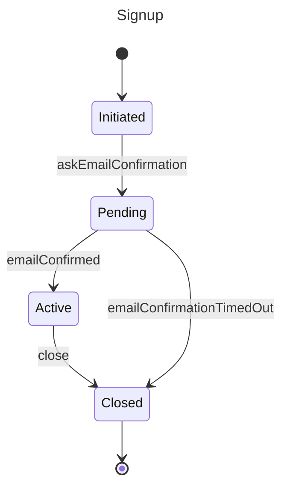

# Finite state machine

Example of a finite state machine for a signup workflow as a [Mermaid diagram](mermaid-diagram.md).

```mermaid
---
title: Signup
---
stateDiagram-v2
  [*] --> Initiated
  Initiated --> Pending: askEmailConfirmation
  Pending --> Active: emailConfirmed
  Active --> Closed: close
  Pending --> Closed: emailConfirmationTimedOut
  Closed --> [*]

```